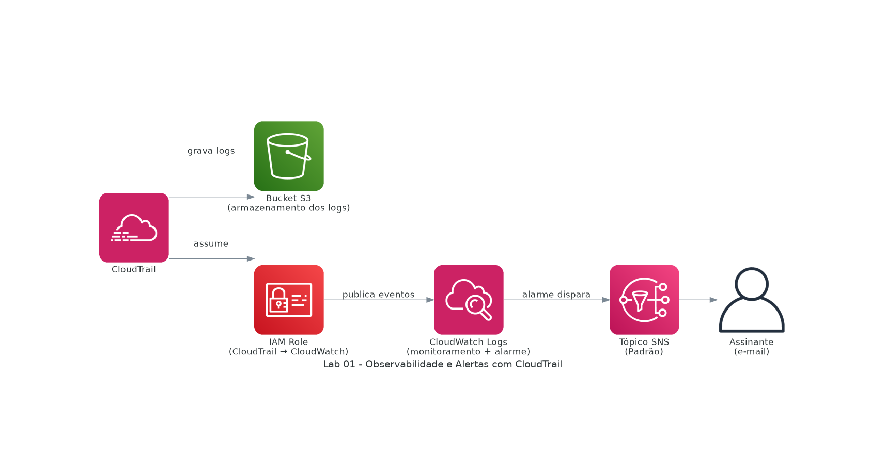

# 01 · Observabilidade e Alertas com CloudTrail

**Domínio do SAA:** Domínio 1 - Design de Arquiteturas Seguras
**Serviços:** CloudTrail, Amazon S3, CloudWatch Logs, IAM, Amazon SNS
**Data:** 2026-08

## Contexto

Toda arquitetura segura precisa de rastreabilidade: saber quem fez o quê, quando e com qual identidade na conta AWS. Este laboratório configura uma trilha de auditoria de eventos da conta com monitoramento ativo e notificação automática, em vez de depender de alguém checando logs manualmente.

## Arquitetura



```
CloudTrail → Amazon S3 (armazenamento dos logs)
CloudTrail → CloudWatch Logs (monitoramento) → Alarme → SNS → E-mail do assinante
```

Diagrama gerado a partir de código com `diagram.py` (biblioteca `diagrams`) — rode `python3 diagram.py` para regenerar.

## Serviços e Decisões de Configuração

| Serviço | O que faz nesse cenário | Decisão de configuração relevante |
|---|---|---|
| CloudTrail | Captura os eventos de API/atividade da conta AWS | Os logs capturados precisam ser direcionados a um bucket do S3 — existente ou criado no momento da trilha |
| Amazon S3 | Armazena os logs brutos capturados pelo CloudTrail | Bucket dedicado ao armazenamento de longo prazo dos eventos |
| CloudWatch Logs | Monitora os eventos em tempo real e permite criar alarmes sobre atividades específicas | Requer: habilitar CloudWatch Logs na trilha, escolher/criar um Grupo de Logs, e uma Role do IAM que o CloudTrail assume para poder enviar os eventos |
| IAM | Concede ao CloudTrail permissão para publicar no CloudWatch Logs em nome do serviço | Role específica com escopo mínimo necessário para essa integração |
| Amazon SNS | Distribui a notificação de alerta para o(s) assinante(s) | Tópico **Padrão** escolhido em vez de FIFO — o caso de uso não exige ordenação estrita nem taxa de transferência baixa; assinante por e-mail precisa aceitar o convite enviado antes de começar a receber notificações |

## O que isso demonstra

- Design de observabilidade proativa (detectar → alertar) em vez de auditoria reativa.
- Entendimento de para que serve cada tipo de tópico SNS (Padrão vs. FIFO) e a implicação de possível duplicidade de mensagens em tópicos Padrão.
- Delegação de permissão entre serviços via IAM Role (CloudTrail assumindo role para publicar no CloudWatch Logs), em vez de credenciais estáticas.
- Base direta para práticas de segurança e governança do Domínio 1 do SAA — auditoria e evidência de atividade na conta.

## Referências

- [AWS CloudTrail – User Guide](https://docs.aws.amazon.com/awscloudtrail/latest/userguide/)
- [Amazon SNS – Message ordering and deduplication](https://docs.aws.amazon.com/sns/latest/dg/sns-fifo-topics.html)
