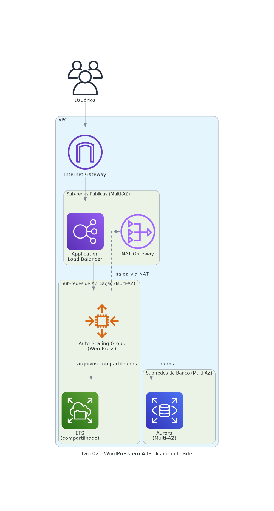

# 02 · Aplicação WordPress em Alta Disponibilidade

**Domínio do SAA:** Domínio 2 - Arquiteturas de Alto Desempenho e Resiliência
**Serviços:** Amazon VPC, AWS CloudFormation, Amazon RDS Aurora, Amazon EFS, Application Load Balancer, EC2 Auto Scaling
**Data:** 2026-09

## Contexto

Migração de uma aplicação Web (portal de contas/campanhas de marketing) de um data center on-premises para uma arquitetura em nuvem que precisa ser rápida, durável, dimensionável e mais econômica que a infraestrutura anterior, com um protótipo funcional entregável em prazo curto.

## Arquitetura



```
Internet → Application Load Balancer (sub-redes públicas)
         → Target Group → Auto Scaling Group (sub-redes de aplicação, Multi-AZ)
                         → Amazon EFS (armazenamento compartilhado entre instâncias)
                         → Amazon RDS Aurora Multi-AZ (sub-redes de banco)

Toda a rede (VPC, sub-redes, Internet Gateway, NAT Gateway) provisionada via AWS CloudFormation.
```

Diagrama gerado a partir de código com `diagram.py` (biblioteca `diagrams`) — rode `python3 diagram.py` para regenerar.

## Serviços e Decisões de Configuração

| Serviço | O que faz nesse cenário | Decisão de configuração relevante |
|---|---|---|
| Amazon VPC | Isola a rede em sub-redes públicas e privadas | 2 sub-redes públicas, 2 privadas de aplicação e 2 privadas de banco, distribuídas em duas Zonas de Disponibilidade — separação de banco e aplicação por segurança, não por exigência técnica |
| AWS CloudFormation | Provisiona a rede e o modelo de execução do Auto Scaling de forma declarativa | Uso de templates pré-configurados com parâmetros (nome do banco, endpoint, tipo de instância) em vez de criação manual dos recursos |
| Amazon RDS Aurora | Banco de dados relacional gerenciado, compatível com MySQL | Multi-AZ habilitado (réplica em outra AZ) para Alta Disponibilidade; criptografia e monitoramento aprimorado desativados nesta configuração por decisão de custo/desempenho do cenário — não é a prática recomendada por padrão |
| Amazon EFS | Sistema de arquivos compartilhado entre as instâncias de aplicação | Modo de desempenho de Uso Geral e throughput de Intermitência, para manter custo controlado; destinos de montagem nas sub-redes de aplicação |
| Application Load Balancer | Distribui tráfego HTTP (camada 7) entre as instâncias saudáveis | Health check com tolerância alta (10 falhas consecutivas, timeout de 50s) para não remover instâncias por lentidão pontual |
| EC2 Auto Scaling | Cria/remove instâncias de aplicação conforme demanda, mantendo a capacidade definida | Capacidade mínima 2 / máxima 4; health check do próprio ELB (não só da instância EC2) com 300s de período de carência antes de considerar uma instância não saudável |

## O que isso demonstra

- Arquitetura sem estado na camada de computação: nenhuma instância EC2 guarda sessão ou arquivo — o estado vive no RDS (dado relacional) e no EFS (arquivo compartilhado), o que permite que o Auto Scaling substitua instâncias sem perda de dado.
- Uso de Infraestrutura como Código (CloudFormation) para garantir reprodutibilidade do ambiente, em vez de configuração manual sujeita a erro humano.
- Entendimento de para que serve cada configuração de health check (Target Group vs. Auto Scaling) e como ela evita substituição prematura de instâncias saudáveis.
- Trade-offs conscientes entre custo e melhores práticas (ex: criptografia desativada por decisão do cenário) — reconhecer quando uma configuração é adequada ao laboratório mas não seria a recomendação padrão em produção.

## Referências

- [Amazon Aurora – User Guide](https://docs.aws.amazon.com/AmazonRDS/latest/AuroraUserGuide/)
- [Amazon EFS – User Guide](https://docs.aws.amazon.com/efs/latest/ug/)
- [AWS CloudFormation – User Guide](https://docs.aws.amazon.com/AWSCloudFormation/latest/UserGuide/)
